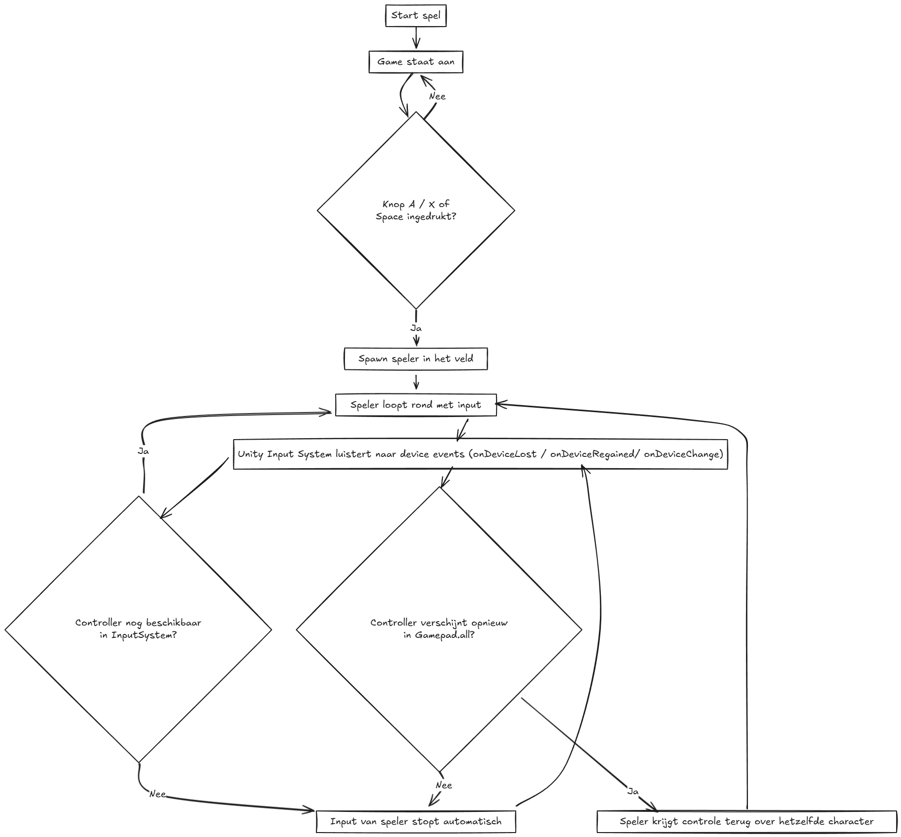
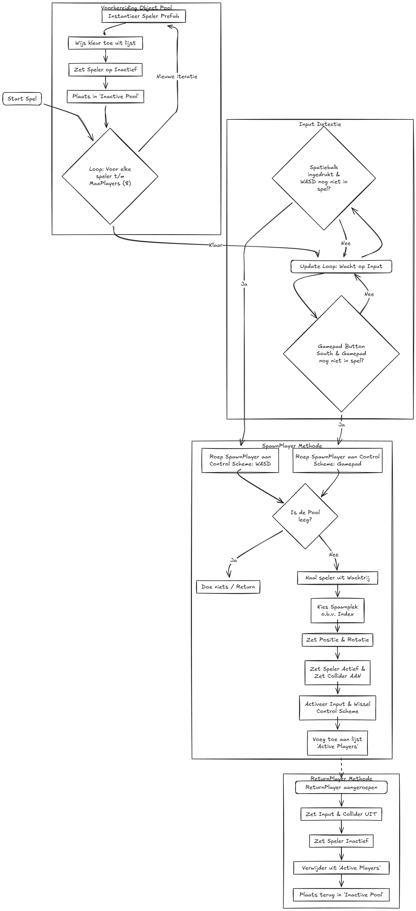
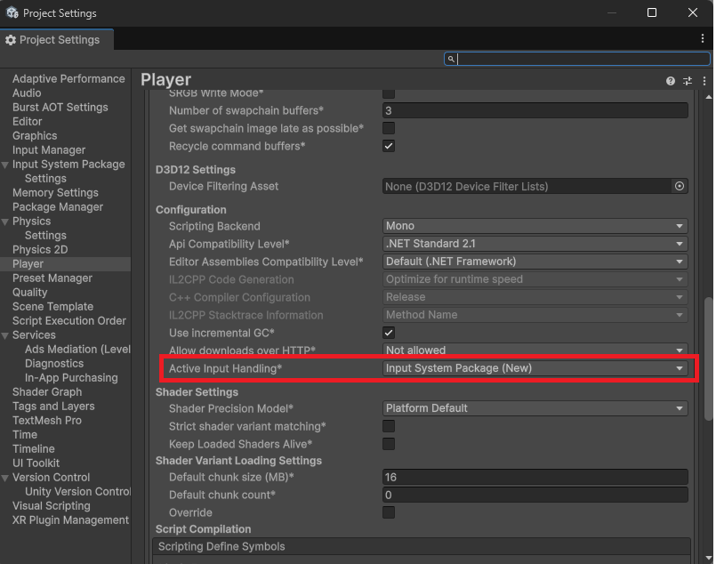
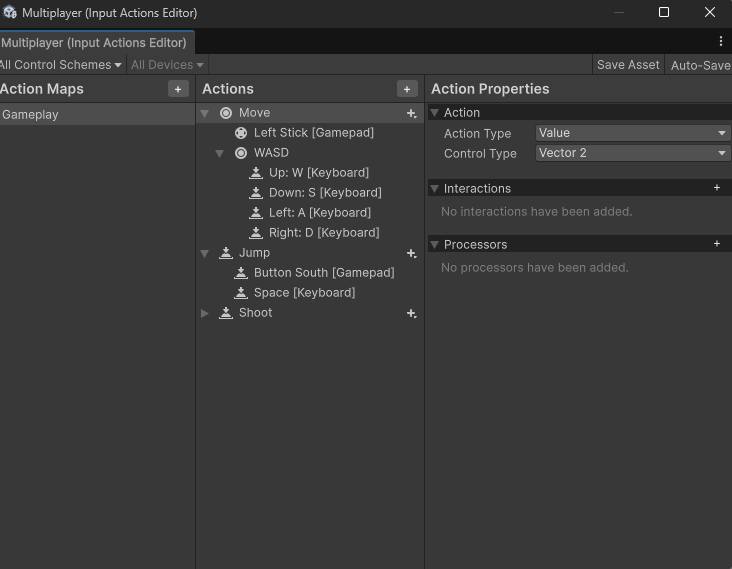
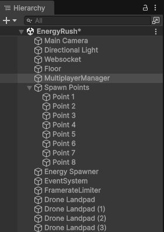
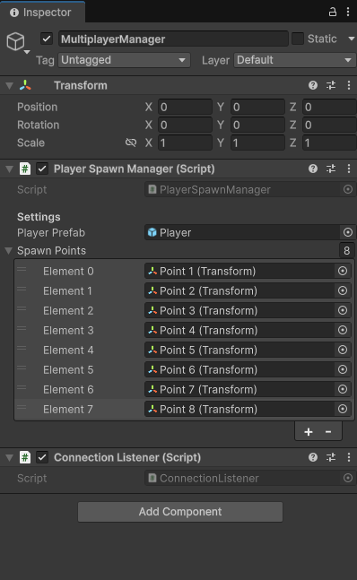
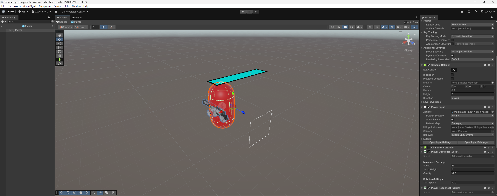
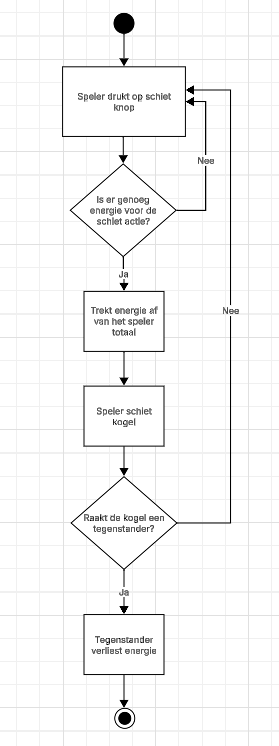
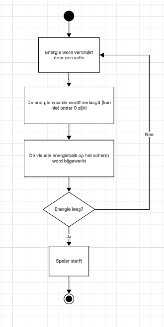
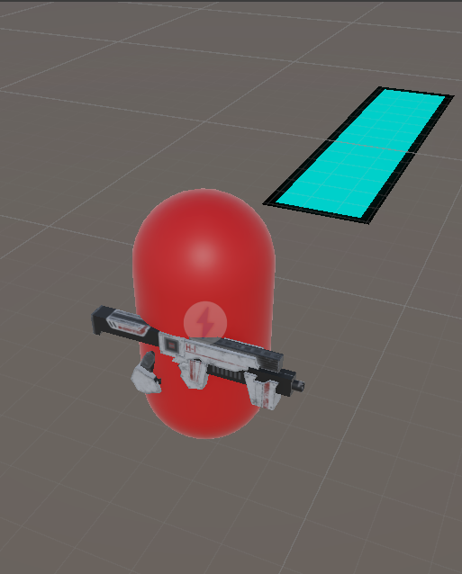

# Overdrachts Documentatie - Drones Cup Project

## Inleiding

Dit document bevat alle technische documentatie voor het overdragen van het Drones Cup project aan een volgende groep. Elk systeem en component wordt in detail uitgelegd met architectuur, implementatie details, testing en best practices.

**Project**: Drones Cup  
**Laatst bijgewerkt**: Januari 2026

---

## Inhoudsopgave

1. [Energy Spawning Systeem](#1-energy-spawning-systeem)
   - Overzicht
   - Architectuur
   - Classes (EnergySpawner, EnergyPickup, PlayerEnergyHandler)
   - Workflow
   - Testing

---

## 1. Energy Spawning Systeem

### 1.1 Overzicht

Het energy spawning systeem is verantwoordelijk voor het spawnen en beheren van energie orbs die spelers kunnen oppakken om hun energie bij te vullen. Het systeem bestaat uit drie hoofdcomponenten die samenwerken om een efficiënt en performant pickup systeem te creëren.

---

### 1.2 Architectuur

#### Component Diagram

```
EnergySpawner (Spawner/Manager)
    ↓ spawnt en beheert
EnergyPickup (Pickup Logica)
    ↓ interacteert met
PlayerEnergyHandler (Speler Energie)
```

---

### 1.3 Classes

#### 1.3.1 EnergySpawner.cs

**Locatie**: `Assets/Scripts/EnergySpawner/EnergySpawner.cs`

**Doel**: Deze class is de centrale manager voor het spawnen en hergebruiken van energie orbs binnen een gedefinieerd gebied.

#### Kernfunctionaliteit

- **Object Pooling**: Gebruikt een efficiënt pooling systeem om performance te optimaliseren
  - `_inactivePool`: Queue van inactieve orbs die klaar zijn voor hergebruik
  - `_active`: HashSet van actieve orbs in de scene
  
- **Spawn Area**: Gebruikt een Collider component om het spawn gebied te definiëren
  - Orbs worden willekeurig gespawnt binnen de bounds van de collider
  - De Y-positie is vast en wordt bepaald door `spawnYLevel`

- **Lifecycle Management**:
  - Bij `Start()`: Creëert een pool van `maxObjects` orbs en activeert ze allemaal
  - Bij `OnPickupConsumed()`: Deactiveert de geconsumeerde orb en spawnt een nieuwe op een willekeurige positie

#### Belangrijke Parameters

- `prefabToSpawn`: De prefab van de energie orb die gespawnt moet worden
- `maxObjects`: Het maximum aantal actieve orbs (standaard: 10)
- `spawnYLevel`: De vaste Y-hoogte waarop orbs spawnen

#### Belangrijke Methodes

- `Start()`: Initialiseert de pool en spawnt initiële orbs
- `OnPickupConsumed(GameObject)`: Callback wanneer een orb wordt opgepakt
- `ActivateOne()`: Activeert één orb uit de pool op een nieuwe positie
- `FindSpawnPosition()`: Vindt een willekeurige positie binnen de spawn bounds
- `PreparePickup(GameObject)`: Configureert een orb met het EnergyPickup component

#### Design Patterns

- **Object Pooling**: Voor memory efficiency en betere performance
- **Observer Pattern**: Via callback `OnPickupConsumed()`

---

#### 1.3.2 EnergyPickup.cs

**Locatie**: `Assets/Scripts/EnergySpawner/EnergyPickup.cs`

**Doel**: Deze class beheert de pickup logica voor individuele energie orbs en de interactie met de speler.

#### Kernfunctionaliteit

- **Collision Detection**: Gebruikt `OnTriggerEnter` om te detecteren wanneer een speler de orb raakt
- **Energy Transfer**: Geeft energie aan de speler via `PlayerEnergyHandler.AddEnergy()`
- **Lifecycle Notification**: Informeert de spawner dat de orb is geconsumeerd

#### Belangrijke Parameters

- `energyAmount`: Hoeveel energie de orb geeft aan de speler (standaard: 10)

#### Belangrijke Methodes

- `Init(EnergySpawner)`: Initialiseert de referentie naar de spawner
- `OnTriggerEnter(Collider)`: Detecteert speler collision en triggert pickup logica

#### Vereisten

- GameObject moet een `Collider` component hebben met `isTrigger = true`
- Vereist een `EnergySpawner` referentie via `Init()`

---

#### 1.3.3 PlayerEnergyHandler.cs

**Locatie**: `Assets/Scripts/PlayerEnergyHandler.cs`

**Doel**: Beheert de energie/health van de speler inclusief UI feedback.

#### Kernfunctionaliteit

- **Energy Management**: Houdt huidige en maximum energie bij
- **Energy Addition**: Via `AddEnergy()` voor pickups
- **Energy Depletion**: Via `TakeDamage()` en `TryShootEnergy()`
- **UI Integration**: Update een fill bar om energie visueel weer te geven
- **Death Handling**: Triggert death logica wanneer energie ≤ 0

#### Belangrijke Parameters

- `maxEnergy`: Maximum energie capaciteit (standaard: 100)
- `currentEnergy`: Huidige energie level
- `energyBarFill`: UI Image component voor de energy bar

#### Belangrijke Methodes

- `AddEnergy(int)`: Voegt energie toe (gebruikt door pickups)
- `TakeDamage(float)`: Vermindert energie door damage
- `TryShootEnergy(float)`: Probeert energie te gebruiken voor schieten
- `UpdateEnergyBar()`: Update de UI fill amount
- `Die()`: Wordt aangeroepen wanneer energie op is

---

### 1.4 Workflow

#### 1.4.1 Initialisatie (Game Start)

```
1. EnergySpawner.Start() wordt aangeroepen
2. Spawner creëert een pool van 'maxObjects' orbs
3. Alle orbs krijgen een EnergyPickup component via PreparePickup()
4. Alle orbs worden geactiveerd op willekeurige posities binnen bounds
```

#### 1.4.2 Pickup Flow

```
1. Speler (met PlayerEnergyHandler) raakt een orb (trigger collision)
2. EnergyPickup.OnTriggerEnter() detecteert de speler
3. PlayerEnergyHandler.AddEnergy() wordt aangeroepen
4. Speler energie wordt verhoogd (max = maxEnergy)
5. EnergySpawner.OnPickupConsumed() wordt aangeroepen
6. Orb wordt gedeactiveerd en teruggezet in de pool
7. Een nieuwe orb wordt direct geactiveerd op een nieuwe positie
8. Totaal aantal actieve orbs blijft constant op 'maxObjects'
```

#### 1.4.3 Respawn Mechanisme

```
1. Geconsumeerde orb gaat naar _inactivePool
2. ActivateOne() haalt een orb uit de pool
3. Orb krijgt nieuwe positie via FindSpawnPosition()
4. Collider wordt heractiveerd
5. GameObject wordt SetActive(true)
6. Orb wordt toegevoegd aan _active HashSet
```

---

### 1.5 Testing

**Locatie**: `Assets/Tests/EnergySpawnerTests.cs`

Het systeem heeft uitgebreide unit tests om correctheid te garanderen:

#### Test Cases

**1. `Start_SpawnsExactNumberOfActiveObjects()`**
- **Doel**: Verificeert dat precies `maxObjects` aantal orbs actief zijn na Start()
- **Verwacht**: Exact 10 actieve orbs in de scene

**2. `Start_SpawnsAllObjectsWithinBounds()`**
- **Doel**: Controleert of alle gespawnde orbs binnen de collider bounds zijn
- **Validaties**:
  - X-positie binnen bounds.min.x en bounds.max.x
  - Z-positie binnen bounds.min.z en bounds.max.z
  - Y-positie exact gelijk aan spawnYLevel

**3. `Consume_MaintainsMaxActive_AndAlwaysWithinBounds()`**
- **Doel**: Test of het systeem het maximum aantal orbs behoudt na consumptie
- **Repeats**: 50x om edge cases te vinden
- **Validaties**:
  - Aantal actieve orbs blijft constant op maxObjects
  - Alle orbs blijven binnen bounds na respawn
  - Geen drift in active count over tijd

**4. `Pickup_AddsEnergyToPlayer()`**
- **Doel**: Verificeert dat pickups correct energie toevoegen aan de speler
- **Setup**: Creëert een test speler met alle vereiste components
- **Validaties**:
  - Energie wordt correct verhoogd met energyAmount
  - Collision detection werkt met trigger events

#### Test Setup

De tests gebruiken een gecontroleerde test omgeving:
- BoxCollider spawn area (10x2x12 units)
- Sphere collider op orbs (isTrigger = true)
- Test player met CapsuleCollider en Rigidbody
- Minimal UI setup voor energy bar

---

## Contact & Ondersteuning

Voor vragen over deze documentatie of het project, raadpleeg:
- De inline code comments in de respectievelijke scripts
- Unity documentatie voor component-specifieke vragen
- Test files voor concrete implementatie voorbeelden

# Hoofdstuk 2: Local Co-op, Input & Player Lifecycle

## Technische vereisten

Voordat met de ontwikkeling van dit systeem kan worden begonnen, moet de ontwikkelomgeving correct zijn ingericht. De volgende vereisten zijn van toepassing:

- **Unity versie**: 6000.2.9f1
- **Input System**: Unity New Input System Package. De installatie en configuratie hiervan worden later in dit document toegelicht.
- **Target devices**: Desktop- en laptopsystemen. Het project is getest met toetsenbord en zowel PlayStation- als Xbox-controllers.

## 1. Scope en verantwoordelijkheid

Dit hoofdstuk beschrijft de opzet en werking van de lokale multiplayerfunctionaliteit binnen het project. De focus ligt hierbij op de volgende onderdelen:

- Local co-op voor 2 tot 8 spelers
- Gebruik van het Unity New Input System
- Betrouwbare koppeling van input per speler en toepassing van object pooling
- Ondersteuning voor player reconnect bij het loskoppelen en opnieuw verbinden van controllers
- Visuele identificatie van spelers via kleurcodering en de DualSense lightbar

Netwerkfunctionaliteit en dronebesturing vallen buiten de scope van dit hoofdstuk.

Dit document is geschreven voor een nieuw ontwikkelteam met basiskennis van Unity en het Unity New Input System. Het doel is dat het team zonder begeleiding de local co-op functionaliteit kan begrijpen, installeren en verder ontwikkelen. De beschreven onderdelen vormen een zelfstandig subsysteem binnen het Energy Rush project en werken samen met andere modules zoals de dronebesturing en netwerklaag. Deze modules worden niet technisch behandeld, maar er wordt wel rekening gehouden met toekomstige integratie.

### Afhankelijkheden

De local co-op module is afhankelijk van de volgende projectonderdelen:

- De algemene player prefab
- De input actions asset
- De centrale gameplay scene

Wijzigingen in deze onderdelen kunnen invloed hebben op de werking van het systeem.

## 2. Doel van dit systeem

Het doel van dit systeem is het realiseren van een stabiele en schaalbare lokale multiplayeropzet waarin:

- Elke speler exact één input device bestuurt
- Spelers dynamisch kunnen joinen en leaven
- Input nooit overlapt tussen spelers
- Het tijdelijk loskoppelen van controllers niet leidt tot het spawnen van nieuwe spelers
- Spelers zichzelf visueel kunnen herkennen op een gedeeld scherm

Het systeem is ontworpen zodat toekomstige teams het eenvoudig kunnen uitbreiden of aanpassen zonder de kernlogica te breken.

Na het lezen van dit hoofdstuk moet een ontwikkelaar in staat zijn om:

- De multiplayer setup in een nieuwe scene te installeren
- Spelers te laten joinen via toetsenbord en controllers
- Reconnect scenario’s te testen en te herstellen
- De spelerprefab veilig uit te breiden met nieuwe gameplayfunctionaliteit
- Het maximum aantal spelers aan te passen zonder kernlogica te breken

Randvoorwaarden van het systeem zijn maximaal acht spelers, ondersteuning voor gemengde input en werking op desktop- en laptophardware.

## 3. Architectuuroverzicht

De lokale co-op functionaliteit is bewust opgebouwd uit afzonderlijke componenten, volgens het Single Responsibility Principle. Dit zorgt voor een overzichtelijke en onderhoudbare structuur.

### Verantwoordelijkheden per script

- **ConnectionListener** behandelt uitsluitend het detecteren van join-input en bevat geen kennis van spelers of prefabs
- **PlayerSpawnManager** is verantwoordelijk voor object pooling, spawnpoints en het activeren van spelers
- **PlayerSetup** initialiseert een speler na het spawnen en stelt input en visuele identificatie in
- **PlayerReconnect** bewaakt de koppeling tussen device en speler bij disconnect en reconnect
- **PlayerController** verwerkt alleen de gameplaybesturing van één individuele speler

Door deze strikte verdeling kan een toekomstig team onderdelen vervangen of uitbreiden zonder de rest van het systeem te beïnvloeden.

## Overzicht van het multiplayer proces

Onderstaande diagrammen tonen de globale architectuur van de local multiplayer module en de communicatie tussen de verschillende componenten. 



Deze architectuur is gekozen om input, spawning en gameplay strikt te scheiden. Hierdoor kan bijvoorbeeld de join-logica worden aangepast zonder de spelerbesturing te beïnvloeden. Het toepassen van het Single Responsibility Principle maakt het systeem testbaar en toekomstbestendig voor uitbreidingen.

### Player spawning lifecycle

Dit proces visualiseert specifiek het object pooling mechanisme en het spawnen van een speler vanaf het moment van join-input tot activatie in de scene.



## 4. Flow van het systeem

### 4.1 Join flow en object pooling

Bij het opstarten van het spel:

- In `Awake()` worden maximaal acht spelerprefabs geïnstantieerd
- Elke speler krijgt vooraf een vaste kleur toegewezen
- Alle spelers worden geplaatst in een inactieve object pool

Tijdens runtime:

1. De **ConnectionListener** luistert naar de volgende join-input:
    - Spatiebalk voor toetsenbordbesturing (WASD)
    - South Button op gamepads (A voor Xbox, X voor PlayStation)

2. Wanneer geldige input wordt gedetecteerd, wordt `SpawnPlayer()` aangeroepen.

3. De **PlayerSpawnManager**:
    - Haalt een spelerobject uit de pool
    - Zet de positie en rotatie op het eerstvolgende beschikbare spawnpoint
    - Activeert de collider en input van de speler
    - Voegt de speler toe aan de lijst met actieve spelers

Wanneer de object pool leeg is, wordt er geen nieuwe speler meer gespawned.

Object pooling is toegepast om performanceproblemen te voorkomen die ontstaan bij runtime instantiëren van prefabs. Door spelers vooraf te creëren wordt garbage collection tijdens het joinen vermeden en blijft de framerate stabiel.

Wanneer twee spelers gelijktijdig join-input geven, wordt de volgorde bepaald door het Input System event. Het systeem garandeert dat elke input exact aan één speler wordt gekoppeld.

### 4.2 Runtime input en reconnect flow

Tijdens gameplay:

- Het Unity Input System luistert continu naar events van aangesloten input devices

Bij een disconnect:

- De input van de betreffende speler wordt automatisch gedeactiveerd
- De speler blijft aanwezig in de scene

Bij reconnect:

- Het systeem controleert of het device eerder aan deze speler gekoppeld was
- De controle wordt opnieuw toegewezen aan dezelfde speler
- Er wordt geen nieuwe speler aangemaakt

Deze werkwijze voorkomt dat spelers worden gedupliceerd of dat input verloren gaat bij tijdelijke verbindingsproblemen.

**Opmerking**: wanneer een controller eerst via Bluetooth is verbonden en tijdens het spelen met een kabel wordt aangesloten, wordt deze herkend als een nieuw input device. Dit resulteert in een extra speler. Om dit te voorkomen moet een controller gedurende de hele speelsessie óf draadloos óf bekabeld worden gebruikt.

## 5. Belangrijke scripts

### ConnectionListener.cs

Verantwoordelijk voor het detecteren van join-input. Bevat geen spawn- of spelerlogica.

**Richtlijn**: aanpassingen aan join-input mogen uitsluitend in dit script plaatsvinden.

### PlayerSpawnManager.cs

Centrale manager voor:

- Object pooling
- Spawnpoints
- Actieve en inactieve spelers
- Kleurtoewijzing en DualSense lightbar

**Richtlijn**: mag geen input afhandelen en blijft verantwoordelijk voor lifecycle en pooling.

### PlayerSetup.cs

Regelt:

- Input pairing
- Control scheme selectie
- Spelerkleur
- Synchronisatie van de DualSense lightbar

De lightbar-aansturing is beveiligd met try-catch.

**Richtlijn**: geen gameplaylogica toevoegen.

### PlayerReconnect.cs

Luistert naar:

- `onDeviceLost`
- `onDeviceRegained`
- `InputSystem.onDeviceChange`

Zorgt voor correcte herbinding van input.

**Richtlijn**: reconnectlogica alleen hier aanpassen.

### PlayerController.cs

Verwerkt movement, rotatie en jump input per speler.

**Richtlijn**: alle gameplay-uitbreidingen hier toevoegen.

### Belangrijke waarschuwing

Het verwijderen van object pooling of dynamisch instantiëren van spelers kan leiden tot haperingen en dubbele input. Het poolingmechanisme moet behouden blijven.

## 6. Installatie en setup in een nieuwe scene

Volg onderstaande stappen om de local co-op setup correct te installeren in een nieuwe scene of een nieuw project.

### Stap 1. Open of maak een scene

1. Open Unity.
2. Ga in het Project venster naar de map **Scenes**.
   * Dubbelklik op de scene die je wilt openen om deze te laden.
   * Wil je een nieuwe scene maken? Klik dan met de rechtermuisknop in de map Scenes, kies Create > Scene en geef de nieuwe scene een naam. Dubbelklik vervolgens op de nieuwe scene om deze te laden.

### Stap 2. Controleer het Input System

1. Ga naar **Edit > Project Settings**.
2. Open **Player**.
3. Navigeer naar **Other Settings**.
4. Controleer onder **Active Input Handling** dat **Input System Package (New)** is geselecteerd.
5. Herstart Unity indien hier wijzigingen zijn aangebracht.



### Stap 3a. Zorg dat de Input Actions asset aanwezig is

Controleer in de Project window of de volgende asset aanwezig is:

Is de asset niet aanwezig:

- Importeer deze vanuit de projectrepository, of
- Kopieer de `Multiplayer.inputactions` file vanuit een bestaande scene of backup

Open de asset door erop te dubbelklikken zodra deze aanwezig is.

### Stap 3b. Controleer de inhoud van de Input Actions asset

1. Open `Multiplayer.inputactions`.
2. Controleer of de volgende control schemes aanwezig zijn:
    - WASD (toetsenbord)
    - Gamepad
3. Controleer per action map (bijvoorbeeld Gameplay) of:
    - Acties zoals **Move** en **Jump** bestaan
    - Deze acties bindings hebben voor zowel WASD als Gamepad
4. Sla eventuele wijzigingen op.

Deze Input Actions asset wordt door elke speler gebruikt en is vereist voor correcte input in de local co-op setup.



### Stap 4. Maak de Multiplayer Manager aan

1. Ga in de **Hierarchy**.
2. Klik met de rechtermuisknop en kies **Create Empty**.
3. Hernoem het GameObject naar **MultiplayerManager**.

### Stap 5. Voeg de multiplayer scripts toe

1. Selecteer **MultiplayerManager**.
2. Voeg via **Add Component** de volgende scripts toe:
    - ConnectionListener
    - PlayerSpawnManager

Dit GameObject fungeert als centrale manager voor join-logica en speler lifecycle.

| Multiplayer Manager Hierarchy | Multiplayer Manager Inspector |
| :---: | :---: |
|  |  |

### Stap 6. Zorg dat de Player Prefab aanwezig en correct geconfigureerd is

1. Controleer in de Project window of de Player Prefab aanwezig is in het project, bijvoorbeeld in `Assets/Prefabs/Player`.
2. Is de Player Prefab niet aanwezig, importeer of kopieer deze vanuit de projectrepository of een eerdere projectversie.
3. Open de Player Prefab in de prefab-editor.
4. Controleer of de prefab de volgende componenten bevat:
    - PlayerInput
    - PlayerSetup
    - PlayerReconnect
    - PlayerController
5. Voeg ontbrekende componenten toe via **Add Component** indien nodig.
6. Sla de prefab op voordat je terugkeert naar de scene.

De Player Prefab is vereist voor het spawnen van spelers en correcte input-afhandeling binnen de local co-op setup.

### Stap 7. Koppel de Input Actions asset aan de Player

1. Selecteer de Player Prefab.
2. Ga in de Inspector naar het component **PlayerInput**.
3. Stel de volgende velden in:
    - **Actions**: Multiplayer (Input Action Asset)
    - **Default Map**: Gameplay
    - **Behavior**: Invoke Unity Events
4. Laat **Auto-Switch** uitgeschakeld, omdat de control scheme handmatig wordt ingesteld bij het spawnen.



### Stap 8. Configureer PlayerSpawnManager

- Selecteer **MultiplayerManager**.
- Ga in de Inspector naar het component **PlayerSpawnManager**.
- Stel de volgende velden in:
    - **Player Prefab**: sleep hier de Player Prefab in
    - **Spawn Points**:
        - Maak in de Hierarchy één of meerdere lege GameObjects aan die dienen als spawnlocaties
        - Plaats deze op de gewenste posities in de scene
        - Voeg deze toe aan de **Spawn Points** lijst via het plus-icoon en sleep de GameObjects erin

Zorg dat er voldoende spawnpoints zijn voor het maximale aantal spelers.


### Stap 9. Test de setup

1. Start de scene met **Play**.
2. Druk op de spatiebalk om een toetsenbordspeler te laten joinen.
3. Druk op de South Button (X of A) op een gamepad om een gamepadspeler te laten joinen.
4. Controleer of:
    - Spelers correct spawnen op de ingestelde spawnpoints
    - Elke speler alleen zijn eigen character bestuurt
    - Spelers een unieke kleur krijgen
    - Er geen fouten verschijnen in de Console

### Stap 10. Optionele test: reconnect

1. Laat een speler joinen met een gamepad.
2. Verbreek tijdelijk de verbinding.
3. Verbind de controller opnieuw.
4. Controleer of dezelfde speler weer controle krijgt zonder opnieuw te spawnen.

## 7. Geteste scenario’s

Het systeem is getest in de volgende situaties:

- Joinen met één tot vier controllers
- Gelijktijdige input zonder overlap
- Disconnect en reconnect van controllers
- Unieke spelerkleuren per speler
- DualSense lightbar feedback (werkt alleen bij bekabelde aansluiting)

Alle tests zijn succesvol uitgevoerd, zonder crashes, input-overlap of editorfouten. De schaalbaarheid naar zes tot acht spelers is technisch voorbereid, maar nog niet in de praktijk getest.

### Minimale regressietests

- Twee spelers met verschillende devices
- Reconnect scenario
- Maximaal aantal spelers bereiken

Acceptatiecriterium is dat er geen consolefouten optreden en input niet overlapt. Alleen wanneer alle bovenstaande tests slagen, mag een nieuwe versie als stabiel worden beschouwd.

## 8. Bekende aandachtspunten

- Het huidige kleurenpalet kan worden verbeterd voor beter visueel contrast van de spelers
- Tests met meer dan vier gelijktijdige controllers zijn nog niet uitgevoerd
- Het wisselen tussen Bluetooth en bekabelde verbinding tijdens het spelen kan leiden tot het aanmaken van een extra speler
- De schaalbaarheid naar acht spelers is alleen theoretisch gevalideerd en nog niet praktisch getest

Deze punten dienen bij een volgende ontwikkelfase als eerste te worden onderzocht en gevalideerd voordat nieuwe functionaliteit wordt toegevoegd.

## 9. Overdrachtsadvies voor vervolgteams

**Hoge prioriteit**
- Behoud het object pooling systeem om performanceproblemen te voorkomen
- Test reconnect scenario’s bij elke wijziging aan input of device-afhandeling

**Middel prioriteit**
- Verbeter het huidige kleurenpalet voor beter visueel contrast op grote schermen
- Voeg duidelijke UI indicatoren toe voor actieve spelers en hun input device

**Lage prioriteit**
- Onderzoek ondersteuning voor meer dan acht spelers en dynamische schaalbaarheid
- De bovenstaande prioriteiten zijn opgesteld om de stabiliteit van het huidige systeem te waarborgen voordat nieuwe functionaliteit wordt toegevoegd.

De bovenstaande prioriteiten zijn opgesteld om de stabiliteit van het huidige systeem te waarborgen voordat nieuwe functionaliteit wordt toegevoegd.

## 3. Drone Interface Application

### 3.1 Scope en verantwoordelijkheid

Dit hoofdstuk beschrijft de opzet, werking en toepassing van de Drone Interface Application.  
Het systeem is verantwoordelijk voor het veilig besturen en monitoren van Crazyflie 2.x drones en voor het faciliteren van externe aansturing via WebSocket.

Binnen de scope van dit hoofdstuk vallen:
- single- en multi-drone besturing;
- veilige uitvoering van vluchtcommando’s;
- real-time telemetrie;
- externe aansturing vanuit applicaties zoals Unity;
- operationele handelingen die direct samenhangen met dit systeem, zoals hardwarevereisten, installatie en opstart.

Game-logica en multiplayerfunctionaliteit vallen buiten de scope van dit hoofdstuk.

---

### 3.2 Doel en ontwerpcontext

Het doel van de Drone Interface Application is het realiseren van een stabiele en uitbreidbare besturingslaag waarin:

- drones gecontroleerd kunnen opstijgen, bewegen en landen;
- meerdere drones centraal beheerd worden;
- veiligheidscontroles automatisch worden afgedwongen;
- zowel handmatige als externe besturing mogelijk is.

Het systeem is ontworpen met het oog op overdraagbaarheid. Hardwarevereisten, installatie en opstart zijn daarom expliciet vastgelegd om afhankelijkheid van impliciete kennis te voorkomen.

---

### 3.3 Architectuuroverzicht

De applicatie is opgebouwd volgens een gelaagde architectuur met een duidelijke scheiding van verantwoordelijkheden.

Externe applicatie (Unity / Game)
↓
WebSocket
↓
WebSocketClient
↓
DroneManager
↓
DroneController
↓
Crazyflie Hardware


Parallel aan deze keten communiceert de desktop-UI rechtstreeks met de DroneManager.  
De UI kan zelfstandig functioneren en is niet afhankelijk van WebSocket-aansturing.

---

### 3.4 Hoofdcomponenten en toepassing

#### 3.4.1 Application (__main__.py)

De Application fungeert als entry point en centrale orkestrator.

**Verantwoordelijkheden**:
- laden van configuratie (`drones.json` en defaults);
- initialiseren van logging;
- creëren van DroneManager en DroneControllers;
- starten van WebSocket-server en UI;
- uitvoeren van een gecontroleerde shutdown.

De Application wordt altijd gestart via het startscript (`start.bat`) om een consistente runtime-omgeving te garanderen.

---

#### 3.4.2 DroneManager

De DroneManager is de centrale beheerlaag voor alle drones.

**Verantwoordelijkheden**:
- registreren en verwijderen van DroneControllers;
- distribueren van drone-events;
- afdwingen van rate limiting;
- ondersteunen van multi-drone scenario’s.

Nieuwe drones worden toegevoegd via configuratie en vereisen geen codewijzigingen.

---

#### 3.4.3 DroneController

De DroneController fungeert als facade voor alle drone-operaties.

De functionaliteit is opgesplitst in drie componenten:

- **ConnectionManager**  
  Beheert connectie, disconnect en reconnect.

- **TelemetryHandler**  
  Verwerkt positie, batterijstatus en positioneringsinformatie.

- **CommandExecutor**  
  Valideert en voert vluchtcommando’s uit.

Voor elk commando worden automatisch veiligheidscontroles uitgevoerd op connectiestatus, batterij en bewegingslimieten.

---

#### 3.4.4 WebSocketClient

De WebSocketClient faciliteert externe besturing via JSON-berichten.

**Kenmerken**:
- ondersteuning voor meerdere drones;
- vaste message-structuur;
- automatische reconnect bij disconnect;
- afhandeling via een handler chain.

Nieuwe commando’s worden toegevoegd via nieuwe handlers zonder aanpassing van bestaande logica.

---

#### 3.4.5 DroneUI

De DroneUI biedt een grafische interface voor handmatige bediening en monitoring.

**Functionaliteit**:
- drone selectie en connectiebeheer;
- real-time weergave van positie, batterij en link quality;
- logging van commando’s en foutmeldingen;
- beperkte runtime-instellingen.

De UI fungeert tevens als monitoring- en debugtool bij WebSocket-aansturing.

---

#### 3.4.6 ConfigurationService

De ConfigurationService verzorgt centrale configuratievoorziening.

**Kenmerken**:
- immutable configuratieobjecten;
- type-safe dataclasses;
- scheiding tussen drone-, performance- en ontwikkelinstellingen.

Configuratiewijzigingen worden toegepast bij herstart van de applicatie.

---

### 3.5 Benodigde hardware

Voor correcte werking van de Drone Interface Application is specifieke hardware vereist.  
Zonder deze hardware kan de applicatie wel starten, maar is fysieke dronebesturing niet mogelijk.

#### 3.5.1 Verplichte hardware

- **Crazyflie 2.x drone**  
  De applicatie ondersteunt Crazyflie 2.x modellen.

- **Crazyradio PA USB dongle**  
  Verzorgt de draadloze communicatie tussen de applicatie en de drone.

Zonder Crazyradio PA is geen verbinding met de drone mogelijk.

---

#### 3.5.2 Aanbevolen hardware

- **Lighthouse positioning systeem**  
  Nodig voor stabiele en nauwkeurige positionering.  
  Zonder lighthouse wordt position-based besturing automatisch geblokkeerd door veiligheidschecks.

- **Dedicated testomgeving**  
  Afgesloten ruimte zonder obstakels om risico’s tijdens testen te beperken.

---

#### 3.5.3 Hardwarevoorbereiding

Voor gebruik:
1. Sluit de Crazyradio PA USB dongle aan op het systeem.
2. Zorg dat de drone volledig is opgeladen.
3. Activeer het lighthouse systeem (indien gebruikt).
4. Plaats de drone binnen bereik van de radioverbinding.

Pas daarna kan de applicatie veilig worden gestart.

---

### 3.6 Installatie en eerste start

#### 3.6.1 Voorgeconfigureerde runtime-omgeving

Het project bevat een vooraf geconfigureerde Python virtual environment (`.venv`).  
Gebruikers hoeven geen handmatige virtual environment aan te maken.

De `.venv` bevat alle vereiste afhankelijkheden voor de Drone Interface Application.

---

#### 3.6.2 Startprocedure van de applicatie

De applicatie wordt gestart via de snelkoppeling **“Drone Interface”**.

**Werking**:
1. De snelkoppeling start `start.bat`.
2. `start.bat` activeert de vooraf geconfigureerde `.venv`.
3. Benodigde dependencies worden gecontroleerd en indien nodig geïnstalleerd.
4. Na succesvolle setup wordt `__main__.py` gestart.

Deze procedure borgt een consistente en reproduceerbare runtime-omgeving.

---

### 3.7 Operationele flows

#### 3.7.1 Opstart en gebruik

Na het starten van de applicatie:
1. wordt de configuratie geladen;
2. start het logging-systeem;
3. worden alle geconfigureerde drones geregistreerd;
4. start de WebSocket-server;
5. wordt de UI getoond.

Drones kunnen vervolgens handmatig of extern worden aangestuurd.

---

#### 3.7.2 Afsluiten en foutafhandeling

Bij afsluiten van de applicatie:
- landen actieve drones gecontroleerd;
- wordt telemetrie gestopt;
- worden connecties gesloten;
- worden achtergrondthreads correct beëindigd.

Deze volgorde voorkomt ongecontroleerd dronegedrag en dataverlies.

---

### 3.8 Testen en validatie

Het systeem wordt gevalideerd via meerdere testlagen:

- **Unit tests** voor DroneController, DroneManager en configuratie;
- **Integratietests** voor WebSocket- en command-routing;
- **Hardwaretests** voor radioverbinding en multi-drone scenario’s.

Na wijzigingen wordt minimaal getest:
- handmatige bediening via de UI;
- externe aansturing via WebSocket;
- correcte foutafhandeling bij disconnect;
- gecontroleerde shutdown.

---

### 3.9 Aanvullende testaanbevelingen

Voer aanvullende tests uit op simultane aansturing van meerdere drones om race conditions en command flooding te voorkomen. Test ook de stabiliteit van radioverbindingen onder verschillende omstandigheden (afstand, interferentie) om betrouwbaarheid te waarborgen. Verdere stappen: implementatie van nieuwe features volgens de beschreven workflow en teststrategie.

---

### 3.10 Overdrachtsadvies

Voor correcte doorontwikkeling wordt geadviseerd:
- installatie en opstart altijd via `start.bat` te laten verlopen;
- geen directe aanpassingen te doen aan de `.venv`;
- nieuwe functionaliteit toe te voegen binnen bestaande componentverantwoordelijkheden;
- veiligheidslogica gecentraliseerd te houden;
- operationele flows opnieuw te testen na wijzigingen.


# 4. Shooting & Energy UI Systeem

## 4.1 Scope en verantwoordelijkheid

Dit hoofdstuk beschrijft de implementatie van de offensieve gameplay-mechanics en de visuele terugkoppeling van de energiestatus aan de speler.

Binnen de scope vallen:

- **De Schiet Mechanic**  
  Het afvuren van projectielen, input-verwerking en de koppeling met het energiesysteem.

- **Projectiel Management**  
  De logica van de kogel (beweging, collision) en prestatie-optimalisatie via Object Pooling.

- **World Space UI**  
  De weergave van de energiebalk boven het hoofd van de speler, inclusief rotatie-correctie (billboarding).

---

## 4.2 Architectuur Diagram (Data Flow)
De architectuur is opgezet volgens het principe van Separation of Concerns. Input, logica, data en visuals zijn gescheiden in afzonderlijke componenten. Dit voorkomt 'spaghetti-code' en zorgt dat het aanpassen van de schietlogica (bijv. sneller schieten) geen invloed heeft op de data (energiebeheer).

De onderstaande flowcharts visualiseren deze scheiding. De linker chart toont de interne logica van het energiesysteem, terwijl de rechter chart toont hoe het schietsysteem die data aanroept.

(Afbeelding 1: Logische flow van de schiet-actie en de interactie met de object pool)

(Afbeelding 2: Logische flow van energieverbruik, update van de UI en de 'Player Death' conditie)



## 4.2.2 Design Rationale (Verantwoording van keuzes)
Component Scheiding vs. Monolithic Script: Er is bewust gekozen om ShootLogic los te trekken van PlayerController. Dit voorkomt een "God Class" (één script dat alles doet) en maakt het mogelijk om het schietsysteem in de toekomst eenvoudig te vervangen of op andere entities (zoals AI) te plaatsen.

Raycasting vs. Physics Colliders: De projectielen (LaserLogic) gebruiken Raycasting voor hit-detectie in plaats van standaard Unity Physics Collisions (OnCollisionEnter).

Reden: Raycasting is performanter voor snelle projectielen en voorkomt het "tunneling" effect (waarbij een snelle kogel door een muur heen vliegt zonder botsing te registreren).

Object Pooling vs. Instantiation:

Reden: In een multiplayer-omgeving met een hoge vuursnelheid zou Instantiate en Destroy zorgen voor veel Memory Allocation en Garbage Collection spikes (lag). Object Pooling elimineert dit door geheugen vooraf te reserveren.

## 4.3 Hoofdcomponenten

### 4.3.1 ShootLogic.cs

**Locatie:**  
`Assets/Scripts/ShootLogic.cs`

**Doel:**  
Verantwoordelijk voor de input-detectie voor het schieten, het beheren van de vuursnelheid (fire rate) en de communicatie met de object pool.

#### Kernfunctionaliteit

- **Energy Check**  
  Controleert vóór elk schot of de speler voldoende energie heeft via  
  `PlayerEnergyHandler.TryShootEnergy()`.


- **Object Pooling**  
  Instantieert geen nieuwe kogels, maar hergebruikt objecten uit een pool om Garbage Collection spikes te voorkomen (essentieel voor multiplayer performance).


- **FirePoint**  
  Gebruikt een specifiek `Transform` punt (leeg child-object aan het uiteinde van het wapen) als spawn-locatie om clipping met de eigen collider van de speler te voorkomen.
     - Waarom: Het spawnen van kogels vanuit het centrum van de speler (transform.position) leidde tijdens tests tot 'self-collision' (de speler schoot zichzelf neer). Het FirePoint verplaatst het spawnpunt fysiek buiten de hitbox van de speler.


  

#### Belangrijke Parameters

- `bulletPrefab` – Referentie naar het kogel-object
- `firePoint` – De fysieke spawnlocatie op het wapenmodel
- `energyCost` – De kosten per schot
  > ⚠️ *Inspector waarde is leidend*

---

### 4.3.2 LaserLogic.cs

**Locatie:**  
`Assets/Scripts/LaserLogic.cs`

**Doel:**  
Beheert het gedrag van een individueel projectiel nadat het is "gespawned".

#### Kernfunctionaliteit

- **Beweging**  
  Verplaatst het object elke frame naar voren gebaseerd op een ingestelde snelheid.  
  Er wordt geen Rigidbody physics gebruikt voor beweging om performance te sparen.

- **Hit Detectie**  
  Maakt gebruik van Raycasting (of Triggers) om botsingen te detecteren.

- **Lifecycle**  
  Schakelt zichzelf uit (terug naar pool) na een botsing of na het verstrijken van een timer, om te voorkomen dat kogels oneindig doorvliegen.

---

### 4.3.3 UI Rotation / Billboarding

**Locatie:**  
`Assets/Scripts/LockUI.cs`  
(of geïntegreerd in het UI-script)

**Doel:**  
Zorgt ervoor dat de World Space UI (de energiebalk boven de speler) altijd leesbaar blijft, ongeacht de rotatie van de speler.

#### Het Probleem & De Oplossing

Omdat het Canvas een child-object is van de speler, draait het normaal gesproken mee.  
Als de speler 90 graden draait, zou de healthbar onzichtbaar worden (plat vlak).

**Implementatie:**  
In de `LateUpdate()` methode wordt de rotatie van het Canvas geforceerd naar de camera gericht.

**Waarom `LateUpdate()`?**  
De camera en speler bewegen in Update. Als de UI in diezelfde frame wordt aangepast, kan er een race-conditie ontstaan wat leidt tot visuele trillingen (jitters). LateUpdate garandeert dat de UI pas draait nadat alle bewegingen zijn berekend.

---

## 4.4 Workflow

### 4.4.1 Het Schietproces

1. **Input**  
   Speler drukt op de schietknop (bv. `E` of controller button vierkantje).

2. **Validatie**  
   `ShootLogic` vraagt aan `PlayerEnergyHandler`:  
   *"Heb ik X energie?"*

3. **Afschrijving**
    - Als `true`: energie wordt direct afgeschreven
    - De UI wordt geüpdatet

4. **Spawning**
    - Een inactieve kogel wordt uit de lijst (Pool) gehaald
    - Positie en rotatie worden gezet op de `FirePoint`
    - Object wordt op **Active** gezet

5. **Impact**  
   `LaserLogic` neemt de besturing over tot impact of despawn.

---

### 4.4.2 Visuals & Feedback

- **Kleurgebruik**  
  Er is gekozen voor blauwe emissive materialen voor de projectielen.  
  Dit zorgt voor visuele coherentie met de blauwe energiebalk (*"Energy"* thema).

- **Spawn Positie**  
  Het `FirePoint` bevindt zich fysiek voor de speler-collider.  
  Dit is een harde vereiste; spawnen vanuit *Center Mass* leidt tot bugs waarbij de speler zichzelf raakt.

  
---

## 4.5 Testing & Validatie

Het systeem is getest op de volgende punten:

- **Performance Test**  
  Snel achter elkaar schieten (*rapid fire*) veroorzaakt geen framedrops dankzij de Object Pool.

- **Collision Test**  
  Kogels raken andere spelers en doen schade, maar negeren de schutter zelf (dankzij correcte FirePoint plaatsing).

- **UI Test**  
  De energiebalk blijft altijd recht naar de camera wijzen, ook als de speler rondjes draait of springt.

---

## 4.6 Overdrachtsadvies

Voor de volgende ontwikkelaars zijn hier de belangrijkste aandachtspunten:

- **Inspector waarden zijn leidend**  
  Tijdens ontwikkeling is gebleken dat waarden in het script (hardcoded defaults) worden overschreven door Unity’s Serialization.  
  Pas waarden zoals *Damage* of *EnergyCost* dus altijd aan in de **Inspector**, niet alleen in het script.

- **Breid de Object Pool uit**  
  Als het aantal spelers toeneemt naar 8+, kan de huidige poolgrootte te klein zijn bij rapid-fire.  
  De pool is dynamisch uitbreidbaar, maar monitor dit bij grotere playtests.

- **Handhaaf de FirePoint structuur**  
  Bij het toevoegen van nieuwe wapens/modellen:
    - Zorg altijd voor een apart `FirePoint` child-object
    - Gebruik **nooit** `transform.position` van de speler zelf als spawnpoint dit kan leiden tot clipping.
